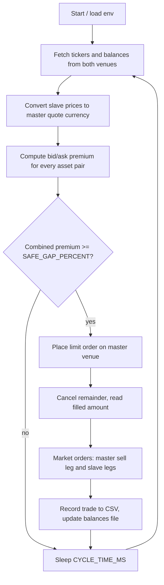

# cross-exchange-arb-bot

A two-venue cross-exchange arbitrage bot written in Node.js. It compares prices of the same assets on a "master" exchange (quoted in MYR) and a "slave" exchange (quoted in USDT), detects spread (premium) opportunities between them, and executes the legs: a limit order on the master venue first, then market orders on both venues once the limit order fills.

> **Status note:** one of the two supported exchanges (FTX) has ceased operations. This code is kept as a reference implementation of the spread-detection and order-sequencing logic, not as a working trading setup.

Built between late 2021 and mid 2022.

## How it works



## Stack

- Node.js, [ccxt](https://github.com/ccxt/ccxt) for exchange access
- bignumber.js for price/percentage arithmetic
- axios, dotenv, fs-extra, systeminformation

## Run

```bash
npm install
cp .env.example .env   # fill in your own credentials and parameters
node index.js
```

Press Ctrl+C once to stop: the bot finishes its cycle, cancels open limit orders and places final market orders. Logs go to the console and to `/tmp/cross-exchange-arb-bot.log`; trades are appended to `trade_data.csv` and balances to `balances.txt` (both git-ignored). `compile.sh` is an optional browserify + obfuscation build.

## Environment variables

| Variable | Required | Description |
|---|---|---|
| `LUNO_KEY`, `LUNO_SECRET` | yes | Master venue API credentials |
| `FTX_KEY`, `FTX_SECRET` | yes | Slave venue API credentials |
| `FTX_SUBACCOUNT_NAME_NOSPACE` | no | Slave venue sub-account name |
| `ASSETS` | yes | Comma-separated list of base assets, e.g. `BTC,ETH,LTC` |
| `SAFE_GAP_PERCENT` | yes | Minimum combined premium (percent) required to trade |
| `MIN_SAFE_GAP_PERCENT` | no | Floor for `SAFE_GAP_PERCENT`; startup aborts below it. Default `0.2` |
| `ORDER_SIZE_MYR` | yes | Order size in master quote currency |
| `CYCLE_TIME_MS` | yes | Delay between cycles in milliseconds |
| `USDTMYR` | no | Fixed USDT to MYR rate; if unset it is fetched from a public price API |

## Disclaimer

This is not financial advice, not audited, and use at your own risk. Trading can lose money. The authors accept no liability.

## License

MIT, see [LICENSE](LICENSE).
